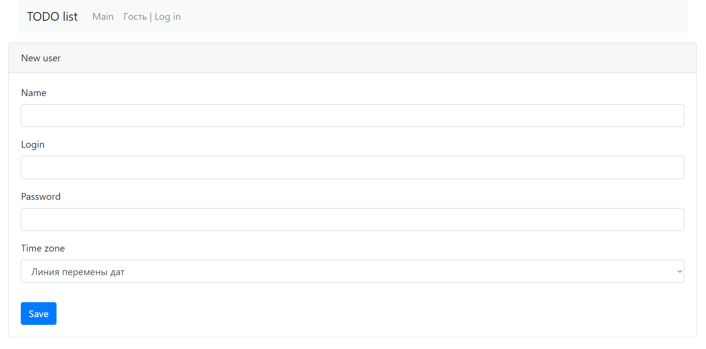
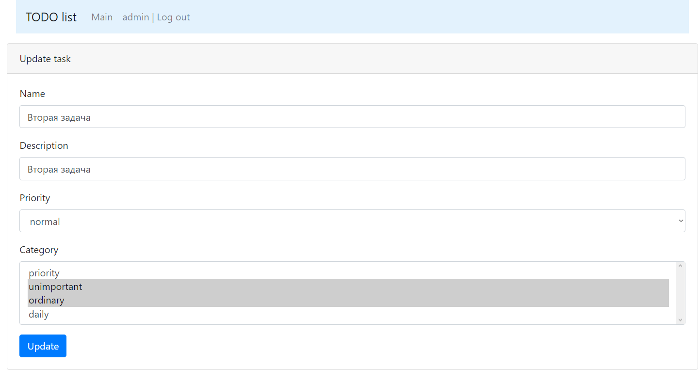

## О проекте

**Приложение _'Список заданий'_**

Данное приложение позволяет просматривать, создавать новые, выполнять, удалять и
редактировать задачи.

Для запуска необходимо:
1. [x] Java 17;
2. [x] Maven 4.0;
3. [x] PostgreSQL 14.

Стек используемых технологий:
* Java 17;
* PostgreSQL JDBC 42.5.0;
* Spring boot 2.7.3;
* Thymeleaf 3.0.15;
* Bootstrap v4.4.1;
* liquibase 4.15.0;
* Hibernate 5.6.11.Final;
* Lombok 1.18.24.

Перед запуском проекта необходимо создать базу данных **'TODO'** и указать
**_login/password_** в файле _src/main/resources/hibernate.cfg.xml_;

Запуск приложения:
```
mvn spring-boot:run
```

**_Интерфейс:_**

1. _Авторизация:_

2. _Ошибка при вводе несуществующего пользователя:_

3. _Регистрация нового пользователя:_

4. Выбор часового пояса, при регистрации

5. _Ошибка при регистрации пользователя с логином, которые уже есть в базе:_

6. _Главное окно (список всех задач):_

7. _Главное окно (список с отбором по выполненным):_

8. _Главное окно (список с отбором по новым-невыполненным задачам):_

9. _Окно создания новой задачи:_

10. _Окно подробно (задача выполнена):_

11. _Окно подробно (задача не выполнена):_

12. _Окно редактирования задачи:_
