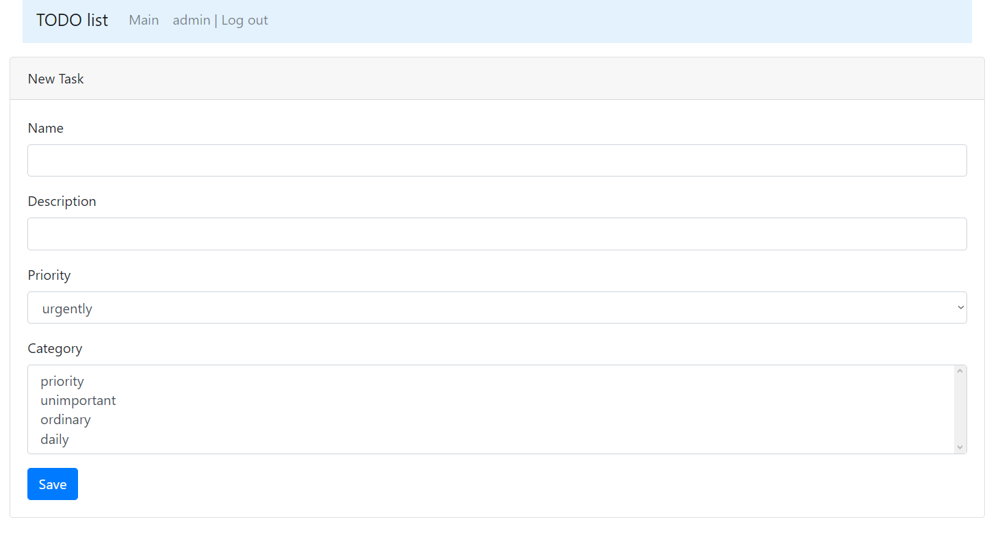
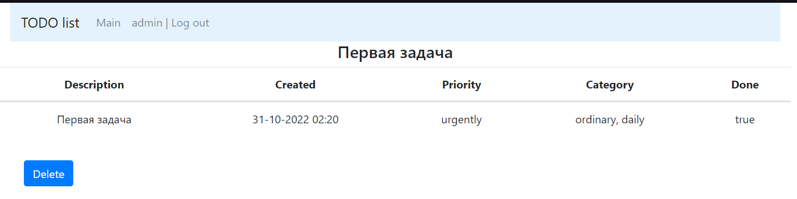
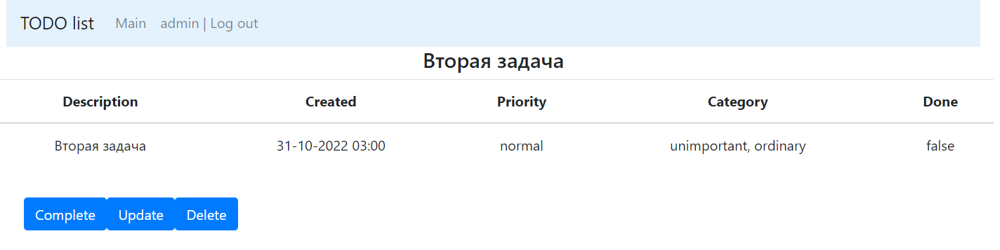

# job4j_todo

## О проекте

Список заданий

Позволяет просматривать задачи, заводить новые, выполнять, удалять и редактировать.

**_Интерфейс:_**

1. _Главное окно (список всех задач):_

2. _Главное окно (список с отбором по выполненным):_

3. _Главное окно (список с отбором по новым-невыполненным задачам):_

4. _Окно создания новой задачи:_

5. _Окно подробно (задача выполнена):_

6. _Окно подробно (невыполненная задача):_

7. _Окно редактирования задания:_
